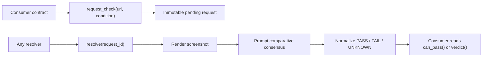

# Visual State Gate

Visual State Gate is a GenLayer Intelligent Contract primitive for contracts that need consensus on what a public webpage visibly shows.

It is not a frontend, app, or recommendation engine. A consumer contract submits a URL and a precise visual condition, anyone resolves it through a screenshot-based consensus round, and downstream logic reads `PASS`, `FAIL`, or `UNKNOWN`.

## Why this exists

Many consequential states are visible but not cleanly machine-readable: a dashboard says a deployment is complete, a public profile displays a required badge, a hosted receipt shows a merchant and amount, or a product page renders a waitlist label through client-side JavaScript.

A backend screenshot service would make one operator the judge. A DOM parser misses canvas, images, layout, hidden overlays, and rendered UI. A single LLM call produces an off-chain opinion. A multisig of reporters turns the primitive into a social process. Visual State Gate keeps the rendered evidence, semantic judgement, and contract-readable result in one consensus domain.

## The primitive

The core workflow is:



The model is asked what the screenshot visibly supports, never what the contract should do. The contract deterministically validates inputs, stores immutable requests, normalizes output, enforces confidence bands, caps attempts, and fails closed.

## Consensus boundary

Nondeterministic operations:

- `gl.nondet.web.render(url, mode="screenshot", wait_after_loaded="1s")`
- `gl.nondet.exec_prompt(prompt, images=[screenshot])`

Everything else is deterministic: request IDs, validation, caps, verdict labels, confidence labels, storage writes, retry rules, and consumer-facing approval.

Equivalence principle:

> Compare the leader and validator outputs as visual evidence judgements for a GenLayer contract. The answer is equivalent only when it preserves the same verdict, confidence band, requested condition, page identity, material visible evidence, and abstention reason. Wording, ordering of evidence bullets, casing, and minor style differences are equivalent when they do not change meaning. A different visible amount, date, name, status, badge, product state, UI label, or any different PASS/FAIL/UNKNOWN result is not equivalent. UNKNOWN is equivalent only to UNKNOWN for substantially the same abstention reason, such as unreadable page, ambiguous evidence, inaccessible render, or insufficient visual support.

## API

- `request_check(url, condition, subject="", consumer_key="") -> str`
- `resolve(request_id) -> None`
- `verdict(request_id) -> str`
- `can_pass(request_id) -> bool`
- `latest_request_for(consumer_key) -> str`
- `get_request(request_id) -> dict`
- `get_config() -> dict`

## Consumer example

See [examples/visual_gate_consumer.py](</C:/Users/DELL/Downloads/intelligent contracts/visual-state-gate/examples/visual_gate_consumer.py>).

The consumer contains no screenshot rendering, prompt construction, output parsing, or equivalence-principle logic. It only requests a check and later reads `can_pass()`.

## Safety properties measured locally

Direct tests passing: 27. StudioNet integration tests passing: 6, driving every write and every view method against a live consensus deployment (`tests/integration/test_visual_state_gate_studionet.py`).

Named properties include:

- `test_unknown_request_reads_fail_closed`
- `test_overlong_url_reverts_instead_of_truncating`
- `test_overlong_condition_reverts_instead_of_truncating`
- `test_pending_request_never_passes_consumer_gate`
- `test_render_failure_records_unknown_external_not_fail_or_pass`
- `test_resolve_unknown_can_be_retried_until_attempt_cap`
- `test_external_unknown_stops_at_attempt_cap`
- `test_requester_is_captured_from_sender`

Lint:

- `contracts/visual_state_gate.py`: clean
- `examples/visual_gate_consumer.py`: clean

Both lint runs report a newer runner is available, but the contract intentionally stays on the pinned runner hash used in the downloaded docs for this pass.

## Honest limits

The current local direct runner returns unusable mocked screenshot bytes for `web.render(..., mode="screenshot")` unless the harness is patched. The direct suite therefore proves the safety and validation surface, including the external-failure `UNKNOWN` path, but does not claim live screenshot PASS convergence.

StudioNet deployment was completed on 2026-07-26 with a dedicated local CLI account named `visual-state-gate-deployer`.

- Contract address: `0x1D4caB4b4C2a88538DAA68054834078Ed860fDEc`
- Deployer: `0xa24Ddf60F3a76Ce6f3d491B657b7965Ff8cc6375`
- Deploy tx: `0xdd896cb5a994bdc2aea9ffc6676273ca9142396de361336919f6f3c63c99f822`
- `request_check` tx: `0x5640b46c8bee0870ee50af207230abfa78b2e1a44834b313561279b01fb67b9e`
- Settled `resolve` tx: `0x6e05e7ebac4ebfc84432b9994149f7a29a7193de1857dce4f0c1ad7bb5ae0033`
- Explorer root: `https://explorer-studio.genlayer.com`

Live `request_check` input:

```powershell
genlayer.cmd write 0x1D4caB4b4C2a88538DAA68054834078Ed860fDEc request_check --args https://example.com "The page visibly shows the Example Domain heading." example live-demo
```

Every write method and every view method on this contract has now been called at least once against the live address.

`resolve("vsg-1")` was retried several times against real consensus rounds. Multiple attempts returned `CANCELED / NO_MAJORITY` with zero rounds and no state mutation — an observed, retryable StudioNet behavior, not hidden as success. It eventually converged with `result_name: MAJORITY_AGREE`, `status_name: ACCEPTED`:

```text
get_request("vsg-1") ->
  status: PASS
  confidence: HIGH
  error_code: NONE
  attempts: 1
  evidence: "The screenshot clearly displays the heading 'Example Domain' in a large,
             bold font at the top of the page content, which matches the requested condition."
verdict("vsg-1") -> PASS
can_pass("vsg-1") -> true
latest_request_for("live-demo") -> vsg-1
get_config().next_id -> 2
```

Once a request reaches `PASS`/`FAIL`, `resolve` correctly reverts on retry (`already terminal`) — confirmed by six further `resolve` calls against the settled request, all of which reverted and left state unchanged.

The `tests/integration/` suite independently deploys fresh contracts on StudioNet and drives the same full write/read surface plus a strict convergence check: two separate requests for the identical URL and condition were both resolved to completion and produced the same `status` and `confidence`, not merely "no crash." One of those convergence rounds needed 8 retries before a round landed — consistent with the flakiness observed against the canonical address above.

## Development

```powershell
$env:PYTHONIOENCODING='utf-8'; genvm-lint check contracts\visual_state_gate.py --json
$env:PYTHONIOENCODING='utf-8'; genvm-lint check examples\visual_gate_consumer.py --json
pytest tests/direct/ -v
$env:PYTHONIOENCODING='utf-8'; gltest tests/integration/ -v -s --network studionet
```

Integration tests deploy their own StudioNet instance and drive every write and view; `resolve` rounds are slow and occasionally need retries, so the suite can take 10-40+ minutes end to end.

## Status

- Phase 0 grounding: complete
- Phase 1 decision record: complete
- Phase 2 design: complete
- Primitive contract: implemented
- Worked consumer example: implemented
- Lint: clean
- Direct tests: 27 passed
- StudioNet integration tests: 6 passed, full write/view surface plus a strict convergence check
- StudioNet deployment: complete
- Live write coverage on the canonical deployed address: every write and every view method called at least once; `resolve("vsg-1")` converged to `PASS` after several `NO_MAJORITY` retries
- Public GitHub repo: not configured in this workspace
